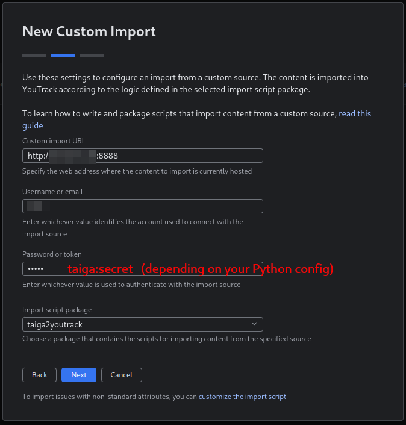
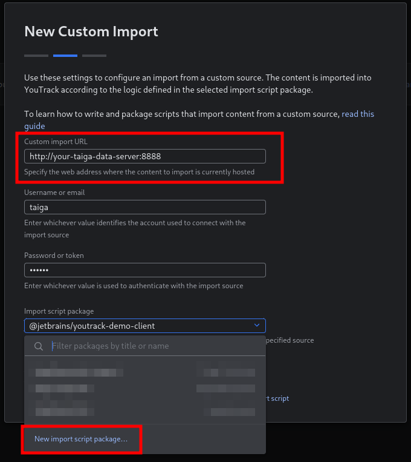
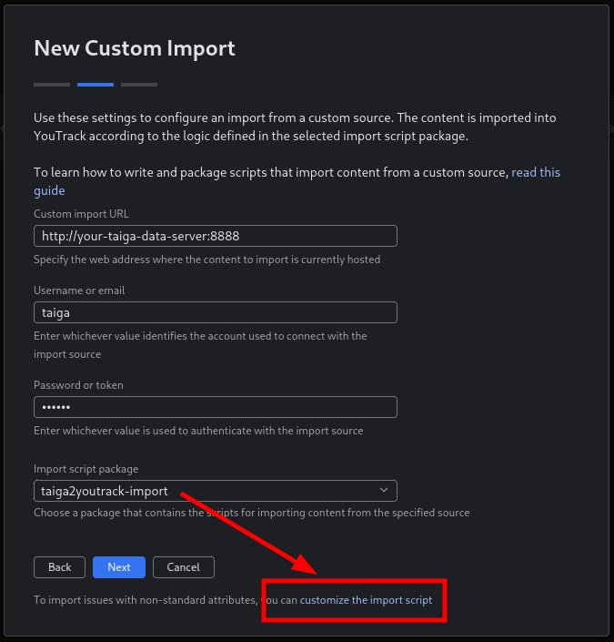
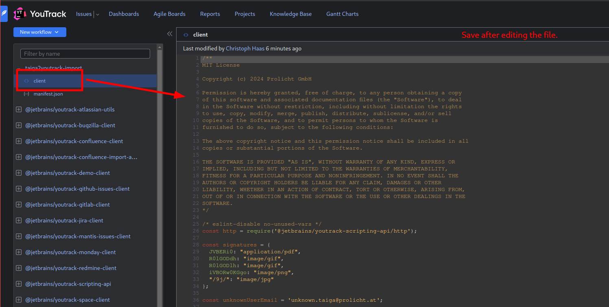
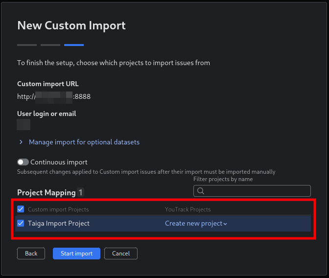
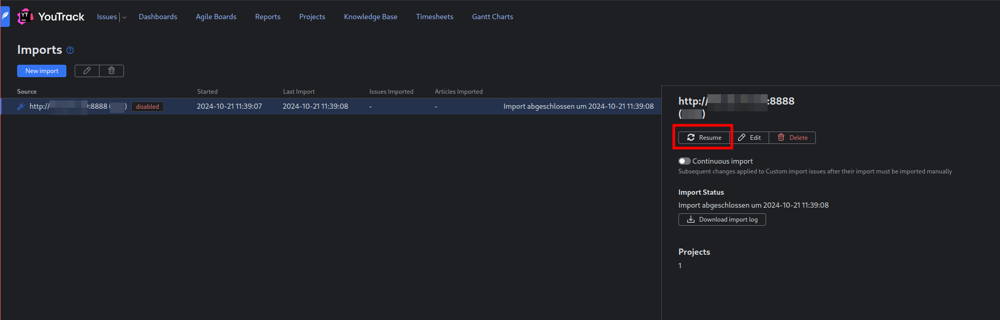
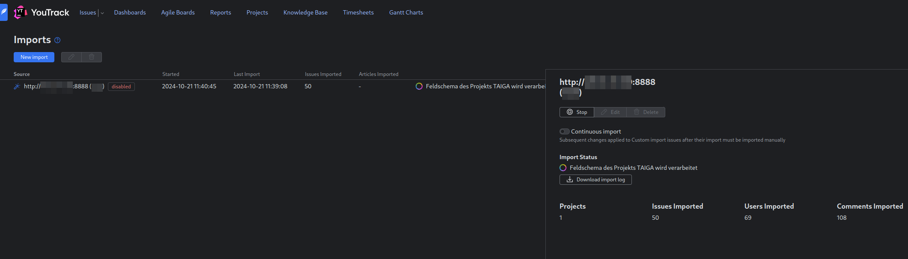

# taiga2youtrack

Migrate Issues, Epics, Userstories and Tasks from Taiga to YouTrack.

## Pre-Requisites

To import the Taiga data to YouTrack, a publicly available server that can execute a Python 3 script is required.


## Migration Process

The migration process has two main stages:

 1. export data from Taiga and make the exported JSON data available via the Python script
 2. create a custom importer in YouTrack and connect it to the Python server

### Taiga Data Export

First of all, you need to export the desired project in Taiga. Therefore, go to `Settings -> Project -> Export` and click the **Export** button.
Once the data is ready, you will be notified by email.
Download the exported data and store the JSON file as `taiga-dump.json`.

Next you need to prepare the publicly available server and the Python script.
Upload the folder `taiga-data-server` to your server, also upload the `taiga-dump.json` into the same directory.
Adapt the variables `BASIC_AUTH_USERNAME` and `BASIC_AUTH_PASSWORD` in the script.
Finally, start the Python script by executing the following commands:

```shell
python -m venv .venv
source .venv/bin/activate
pip install Flask
pip install Flask-BasicAuth
python main.py
```

Test if the server is working, visit http://your-public-ip:8888/status.

### YouTrack Import

Once the Taiga data is ready, you need to create a YouTrack Import Integration.

Go to `Settings -> Integrations -> Imports` and create a new `Custom Import`.

 - Custom import URL: http://your-public-ip:8888 (the URL you used above to test, but without /status)
 - Username or email: the username of your YouTrack admin user
 - Password or token: the value of the `BASIC_AUTH_USERNAME` and `BASIC_AUTH_PASSWORD` variable from the Python script, concatenated with a colon (e.g. username:password)



Next create a new custom `Import script package`. Name it something like **taiga2youtrack** (in the screenshots it might also appear as taiga2youtrack-import).



Modify the import script package, replace the contents of the client file with the one from this repository.




Next, create the project mapping. Either let the importer create a new project, or select a existing one.



The initial import will only create the project. Resume the import once to start the real import of issues, epics, userstories and tasks.



Wait until the import is completed before you start working in YouTrack. 

